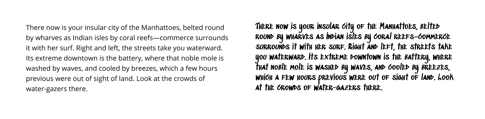

# Readability vs Legibility

**Legibility** is a measure of how easy it is to distinguish one letter from another in a particular typeface. Usually, it’s primarily the concern of the typeface designer, who ensures that each individual character or glyph is unambiguous and distinguishable from all others in the font (See image 1). Legibility is also about choosing the right typeface at the right size.&#x20;

**Readability** can be defined by the combinations of letters that are read within a larger body of text. In other words, readability is defined by how easy it is to read words, phrases, or blocks of copy such as a book, a web page, or an article. Readability depends on factors like style, spacing, font-weight, length of text etc. Legibility also plays a crucial role in making text readable.

