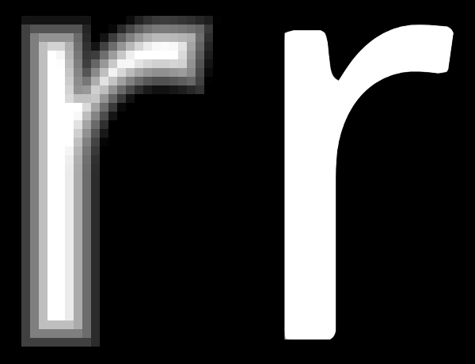

# Text Rendering

If you are designing AR/VR (XR) experiences then good chances are there that you would be working on Unity as it has become the industry standard. Hence in this section, we will discuss the rendering of fonts in Unity and its limitations.

### **Unity Text**

Unity offers multiple ways to use the text based on the type of usage. For 2D text, the “UI Text” component is recommended and “[Text Mesh](https://docs.unity3d.com/2017.3/Documentation/Manual/class-TextMesh.html)” for 3D text is extensively used in games. The supported file formats include TrueType (.TTF) and OpenType (.OTF). For using fonts in applications/games the font files have to be imported as assets in the Unity project and once the font is imported it is rasterised and packed into two assets, “font material” and “font texture**¹**” Unlike other applications which use text outlines to render fonts, the glyphs in Unity are rendered using quads. The font size controls the number of that pixels are used in each glyph to generate texture and rendering beyond that size leads to the pixelated appearance of text.&#x20;

In case the application requires text information that changes in real-time (e.g. location names while driving) the rendering has to be done on the fly. For this Unity gives an option to use _Dynamic Text_ in font import settings. The Dynamic Text uses the Freetype font rendering engine to create font texture in real-time and reduces the file size of the application by using system fonts, thereby replacing the need for font embedding. Content developers use this quite often when they require support for Asian languages or large font sizes that generate massive file sizes to accommodate font textures. However, Dynamic Text allows the embedding of font data using the “Include font data” option. When the font data is not included, and the font is not available in users’ systems, then Unity replaces the font based on a hard-coded global list of fallback fonts that are generally installed on the platform it is being used on.


For best results based on current limitations use TextMesh Pro in your Unity Projects.&#x20;


### Text Mesh Pro

TextMesh Pro is a popular alternative available for Unity users that produces better results using a signed distance field (SDF) technique and advanced shaders to render text. Conventional bitmap fonts (Unity’s default) render fine when used at 1:1 font texture to screen pixels. However, if they are rotated or scaled up during the runtime of the application, then the quality degrades, and pixels or blurred contours start to appear.

Text mesh pro converts OTF/TTF files into signed distance field font asset (font texture) using a font asset creator. The asset creator allows a wide array of options, including specific character sets and kerning pairs. Similar to Unity text, it does not support Indic scripts and ligatures. **The SDF-based rendering is limited to the resolution of the generated texture,** beyond which it retains crisp letter shapes but is unable to preserve the sharpness of corners and the rounding of edges occurs. For example: if a glyph is rendered at 64 pixels per em size and it is used to render size above that, the shape of the glyph becomes uneven (see image 1)

#### Further Reading

[The current state of the text in Augmented Reality](https://niteeshyadav.com/blog/the-current-state-of-the-text-in-augmented-reality-7507/)\
[TextMesh Pro: Localization](https://learn.unity.com/tutorial/textmesh-pro-localization)

**SDF origins and why they matter** - Chris Green, Valve, SIGGRAPH 2007, [_Improved Alpha-Tested Magnification for Vector Textures and Special Effects_](https://steamcdn-a.akamaihd.net/apps/valve/2007/SIGGRAPH2007_AlphaTestedMagnification.pdf?utm_source=chatgpt.com). This is the classic SDF approach used by many real-time text renderers.&#x20;

**Multi-channel SDF (MSDF), solves many SDF artefacts** - msdfgen (Chlumsky) and MSDF resources. MSDF dramatically reduces corner-rounding artefacts of single-channel SDFs and is worth recommending for high-quality scalable text in XR ([GitHub](https://github.com/Chlumsky/msdfgen?utm_source=chatgpt.com))
