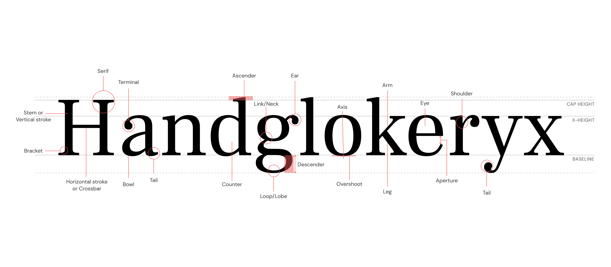

# Type Anatomy

### **Terminology**

To make the type selection easier below are some anatomical features you should know about. The understanding of these features will help you in making informed decisions for a better reading experience in XR.

###

**Ascender** – The part of a lowercase character (b, d, f, h, k, l, t) that extends above the x-height.

**Bar** – The horizontal stroke in characters such as A, H, R, e, and f.\
\
**Bowl** – A curved stroke that creates an enclosed space within a character (space is then called a counter).\
\
**Cap Height** – The height of capital letters from the baseline to the top of caps, most accurately measured on a character with a flat bottom (E, H, I, etc.).\
\
**Counter** – The partially or fully enclosed space within a character.\
\
**Descender** – The part of a character (g, j, p, q, y, and sometimes J) that descends below the baseline.

**Stem** – A straight vertical stroke (or the main straight diagonal stroke in a letter that has no verticals).

**Stroke** – A straight or curved line.

**Terminal** – The end of a stroke not terminated with a serif.\
\
**X-height** – The height of lowercase letters, specifically the lowercase x, not including ascenders and descenders.\

#### Further Reading

[http://thinkingwithtype.com/letter/](http://thinkingwithtype.com/letter/)
