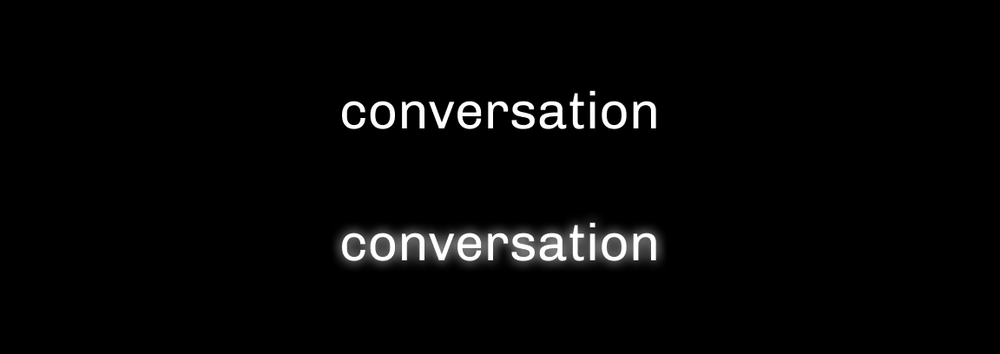
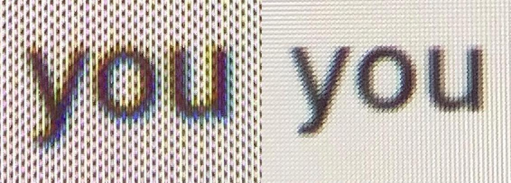

# Aberrations

**Halation:** also known as irradiation is the spreading of light beyond its proper boundaries to form a fog around the edges of a rendered text. The excessive glow around the letters sometimes fills up small negative spaces in the text resulting in legibility issues.

**Chromatic aberration:** is an issue that arises from the inability of a lens to focus all colours in the same place. This happens because the focal length (the distance between the lens and the image sensor when the subject is in focus) depends on a property called refraction, which is the bending of a wave when it enters a medium where its speed is different.&#x20;

Chromatic aberration is caused by lens dispersion, with different colours of light travelling at different speeds while passing through a lens. As a result, the image can look blurred or noticeable coloured edges (red, green, blue, yellow, purple, magenta) can appear around objects, especially in high-contrast situations.

When chromatic aberration occurs in virtual reality, a viewer faces two issues. On one hand, the simple presence of this optical distortion can break the suspension of disbelieve as it serves as a constant reminder of the artificial nature of the virtual environment. On the other hand, it can lead to discomfort and headaches that could make longer VR sessions impossible.

**Screen doors effect:** refers to the visible fine lines between pixels on a display as if you're looking out of a screen door. The term screen door effect was not coined with the advent of virtual reality. It was, and still is, commonly used with LCD and DLP projectors.

\
The screen door effect occurs not because of individual pixel size or density, but because of how large the spaces between pixels are. We can imagine a square sheet of paper that we divide with a pencil right in the middle both horizontally and vertically. This 4x4 grid can be further divided in the same way until we achieve a very high pixel density that will allow us to display high levels of detail. However, the lines that separate these pixels are still the same size and so does the screen door effect remain unaffected.
