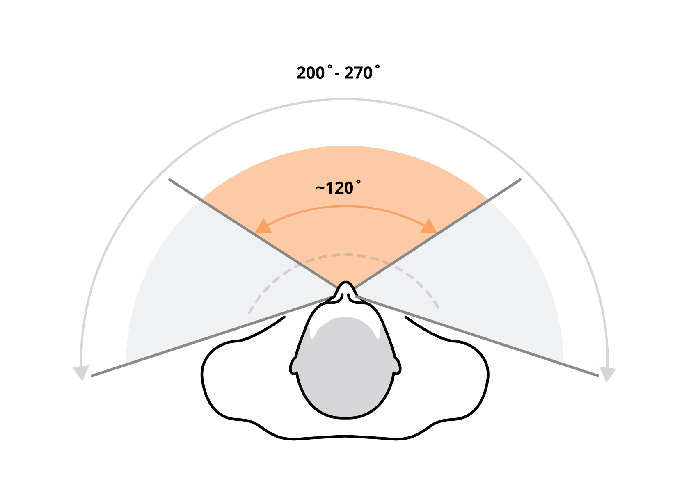

# Field of View

Field of view (FOV) is the range of the observable world at a given point in time which is measured in degrees. Humans have approximately 120 degrees FOV when directly looking in front and up to 200 to 270 degrees with eye rotation (see image 1). In AR field of view is distinguished into overlay FOV (of the headset) and peripheral FOV (of the human eye).


From a typography perspective, this limits the width of the paragraph that should be used in order to provide a better user experience.


Current headsets have FOV ranging between 40–100 degrees which is relatively low as compared to the human eyes; therefore, the user sees cropped images of the objects which are closer to the eyes in space (see image 2). To see the full object either the user has to step back or move their head around hence a wider FOV is preferred for better immersion.&#x20;

