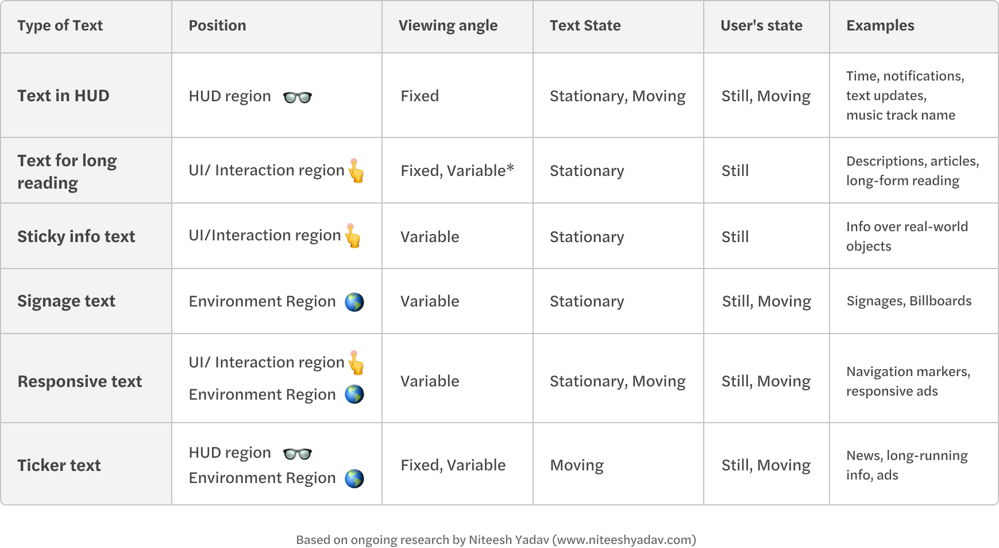

# Types of Text

I have been working on the classification below to understand and define different scenarios and the consideration that should be kept in mind while choosing typefaces, setting text and even designing typefaces for different applications. The classification can also help you pick the right type of methods of rendering [_(know more)_](https://arvrjourney.com/the-current-state-of-the-text-in-augmented-reality-eb65fdfe6703/) for displaying your text in your AR experience and explore the functionality of variable font in different cases. Know about future possibilities in [this video](https://youtu.be/lFO5A8-FzlI?t=3549).

