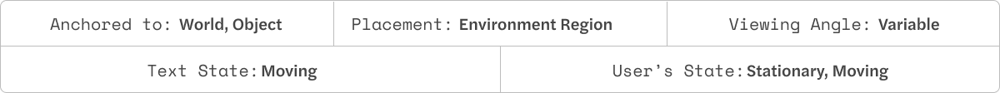

# Ticker text

The term ticker comes from news tickers, the element which has moving text information. Quite a useful method to attract attention and show more information in a small area. Eg: notifications in HUD, showing information in supermarkets.

Image Credit: Keiichi Matsuda
